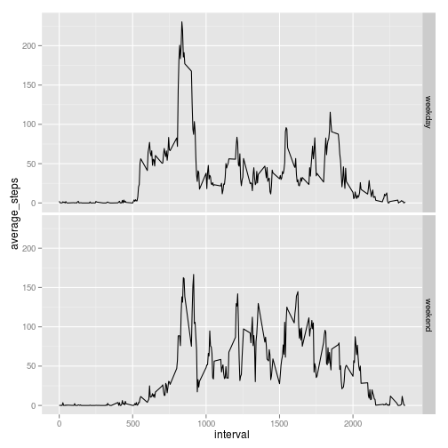

## Loading and preprocessing the data

```r
library(ggplot2)
unzip(zipfile = "activity.zip")
activity <- read.csv("activity.csv")
activity_complete <- activity[complete.cases(activity),]
```

## What is mean total number of steps taken per day?

```r
total_per_day <- aggregate(activity_complete$steps, by=list(activity_complete$date), FUN=sum)
colnames(total_per_day) <- c("date", "total_steps")
print(total_per_day)
```

```
##          date total_steps
## 1  2012-10-02         126
## 2  2012-10-03       11352
## 3  2012-10-04       12116
## 4  2012-10-05       13294
## 5  2012-10-06       15420
## 6  2012-10-07       11015
## 7  2012-10-09       12811
## 8  2012-10-10        9900
## 9  2012-10-11       10304
## 10 2012-10-12       17382
## 11 2012-10-13       12426
## 12 2012-10-14       15098
## 13 2012-10-15       10139
## 14 2012-10-16       15084
## 15 2012-10-17       13452
## 16 2012-10-18       10056
## 17 2012-10-19       11829
## 18 2012-10-20       10395
## 19 2012-10-21        8821
## 20 2012-10-22       13460
## 21 2012-10-23        8918
## 22 2012-10-24        8355
## 23 2012-10-25        2492
## 24 2012-10-26        6778
## 25 2012-10-27       10119
## 26 2012-10-28       11458
## 27 2012-10-29        5018
## 28 2012-10-30        9819
## 29 2012-10-31       15414
## 30 2012-11-02       10600
## 31 2012-11-03       10571
## 32 2012-11-05       10439
## 33 2012-11-06        8334
## 34 2012-11-07       12883
## 35 2012-11-08        3219
## 36 2012-11-11       12608
## 37 2012-11-12       10765
## 38 2012-11-13        7336
## 39 2012-11-15          41
## 40 2012-11-16        5441
## 41 2012-11-17       14339
## 42 2012-11-18       15110
## 43 2012-11-19        8841
## 44 2012-11-20        4472
## 45 2012-11-21       12787
## 46 2012-11-22       20427
## 47 2012-11-23       21194
## 48 2012-11-24       14478
## 49 2012-11-25       11834
## 50 2012-11-26       11162
## 51 2012-11-27       13646
## 52 2012-11-28       10183
## 53 2012-11-29        7047
```

```r
hist(total_per_day$total_steps, breaks=10, xlab="Total number of steps per day", main="")
```

 

```r
print(paste0("Total steps mean: ",round(mean(total_per_day$total_steps))))
```

```
## [1] "Total steps mean: 10766"
```

```r
print(paste0("Total steps median: ",round(median(total_per_day$total_steps))))
```

```
## [1] "Total steps median: 10765"
```


## What is the average daily activity pattern?

```r
average_interval <- aggregate(activity_complete$steps, by=list(activity_complete$interval), FUN=mean)
colnames(average_interval) <- c("interval", "average_steps")

plot(average_interval$interval, average_interval$average_steps, type="l", xlab="interval", ylab="average steps")
```

 

```r
max_interval <- average_interval$interval[max(average_interval$average_steps)==average_interval$average_steps]
print(paste0("Interval with the maximum number of steps: ",paste(max_interval, collapse=",")
              ))
```

```
## [1] "Interval with the maximum number of steps: 835"
```
## Imputing missing values

```r
# let's take average per interval and use for filling empty values:

for(i in 1:nrow(activity)){
    if(!is.na(activity$steps[i])){next}
    value = average_interval$average_steps[average_interval$interval==activity$interval[i]]
    activity$steps[i] <- value
}
total_per_day_full <- aggregate(activity$steps, by=list(activity$date), FUN=sum)
colnames(total_per_day_full) <- c("date", "total_steps")
print(total_per_day_full)
```

```
##          date total_steps
## 1  2012-10-01       10766
## 2  2012-10-02         126
## 3  2012-10-03       11352
## 4  2012-10-04       12116
## 5  2012-10-05       13294
## 6  2012-10-06       15420
## 7  2012-10-07       11015
## 8  2012-10-08       10766
## 9  2012-10-09       12811
## 10 2012-10-10        9900
## 11 2012-10-11       10304
## 12 2012-10-12       17382
## 13 2012-10-13       12426
## 14 2012-10-14       15098
## 15 2012-10-15       10139
## 16 2012-10-16       15084
## 17 2012-10-17       13452
## 18 2012-10-18       10056
## 19 2012-10-19       11829
## 20 2012-10-20       10395
## 21 2012-10-21        8821
## 22 2012-10-22       13460
## 23 2012-10-23        8918
## 24 2012-10-24        8355
## 25 2012-10-25        2492
## 26 2012-10-26        6778
## 27 2012-10-27       10119
## 28 2012-10-28       11458
## 29 2012-10-29        5018
## 30 2012-10-30        9819
## 31 2012-10-31       15414
## 32 2012-11-01       10766
## 33 2012-11-02       10600
## 34 2012-11-03       10571
## 35 2012-11-04       10766
## 36 2012-11-05       10439
## 37 2012-11-06        8334
## 38 2012-11-07       12883
## 39 2012-11-08        3219
## 40 2012-11-09       10766
## 41 2012-11-10       10766
## 42 2012-11-11       12608
## 43 2012-11-12       10765
## 44 2012-11-13        7336
## 45 2012-11-14       10766
## 46 2012-11-15          41
## 47 2012-11-16        5441
## 48 2012-11-17       14339
## 49 2012-11-18       15110
## 50 2012-11-19        8841
## 51 2012-11-20        4472
## 52 2012-11-21       12787
## 53 2012-11-22       20427
## 54 2012-11-23       21194
## 55 2012-11-24       14478
## 56 2012-11-25       11834
## 57 2012-11-26       11162
## 58 2012-11-27       13646
## 59 2012-11-28       10183
## 60 2012-11-29        7047
## 61 2012-11-30       10766
```

```r
hist(total_per_day_full$total_steps, breaks=10, xlab="Total number of steps per day", main="")
```

 

```r
print(paste0("Total steps mean: ",round(mean(total_per_day_full$total_steps))))
```

```
## [1] "Total steps mean: 10766"
```

```r
print(paste0("Total steps median: ",round(median(total_per_day_full$total_steps))))
```

```
## [1] "Total steps median: 10766"
```

```r
## Are there differences in activity patterns between weekdays and weekends?
weekday <- c('Monday', 'Tuesday', 'Wednesday', 'Thursday', 'Friday')
activity$day <- NA
for(i in 1:nrow(activity)){
    activity$day[i] <- if(weekdays(as.Date(activity$date[i])) %in% weekday){"weekday"} else{"weekend"}
}

average_interval_full <- aggregate(activity$steps, by=list(activity$interval, activity$day), FUN=mean)
colnames(average_interval_full) <- c("interval", "day", "average_steps")

qplot(x=interval, y=average_steps, data=average_interval_full, geom="line",facets=day~.)
```

 
